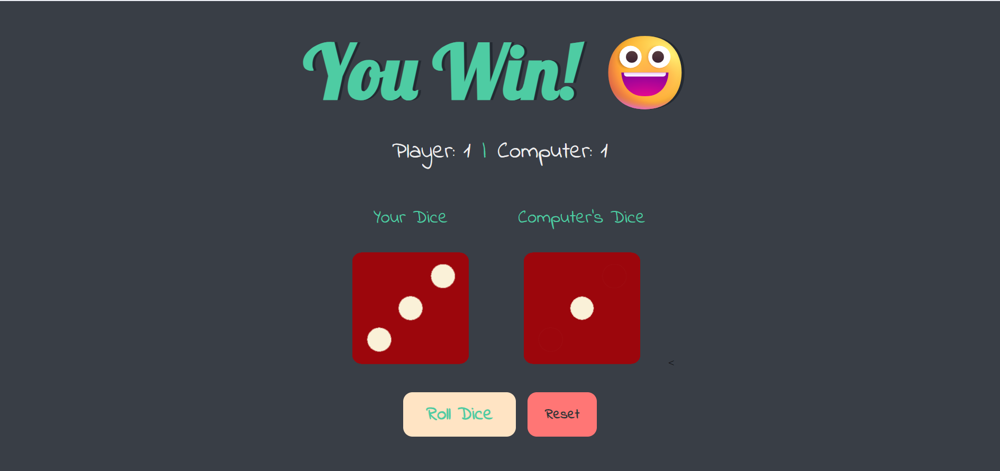

# 🎲 Dicee Game

A fully interactive, web-based dice rolling game built with HTML, CSS, and Vanilla JavaScript. Test your luck against the computer in this fun mini-game!



## ✨ Features

- **Interactive Gameplay:** Roll the dice to compete against the computer.
- **Score Tracking:** Keeps a running tally of player and computer wins across the session.
- **Immersive UX:** Features CSS shaking animations and satisfying dice-rattling sound effects.
- **Clean UI:** Responsive design with a modern dark-mode aesthetic and custom Google Fonts.
- **Reset Functionality:** Easily clear the board and start a new match with one click.
- **Accessible & Semantic:** Built with semantic HTML tags and proper image alt-text for screen readers.

## 🛠️ Tech Stack

- **HTML5:** Semantic structure and accessibility.
- **CSS3:** Custom styling, Flexbox layouts, and `@keyframes` animations.
- **Vanilla JavaScript (ES6+):** DOM manipulation, event listeners, state management, and the HTML5 Audio API.

## 🚀 Getting Started

To run this project locally, you don't need any complex build tools or dependencies. Just a browser!

1. **Clone the repository:**

   ```bash
   git clone [https://github.com/your-username/dicee-game.git](https://github.com/your-username/dicee-game.git)

   ```

2. ```bash
   cd dicee-game

   ```

3. **Open the game:**
   Simply double-click the index.html file to open it in your default web browser, or use an extension like VS Code's "Live Server".

## 📁 Project Structure

📦 dicee-game
┣ 📂 images
┃ ┣ 📜 dice1.png
┃ ┣ 📜 dice2.png
┃ ┣ 📜 dice3.png
┃ ┣ 📜 dice4.png
┃ ┣ 📜 dice5.png
┃ ┗ 📜 dice6.png
┣ 📂 sounds
┃ ┗ 📜 dice-roll.wav
┣ 📜 index.html
┣ 📜 styles.css
┗ 📜 index.js

## 🧠 What I Learned

This project was a great exercise in refactoring and cleaning up code. Key takeaways include:

- State Management: Separating the UI updates from the underlying data (scores).

- DOM Caching: Storing DOM elements in variables to improve performance.

- Timing Events: Using setTimeout to sync JavaScript logic with CSS animations.

- Audio API: Instantiating and playing audio objects directly via JavaScript without cluttering the HTML.

**🤝 Contributing**
Contributions, issues, and feature requests are welcome!
